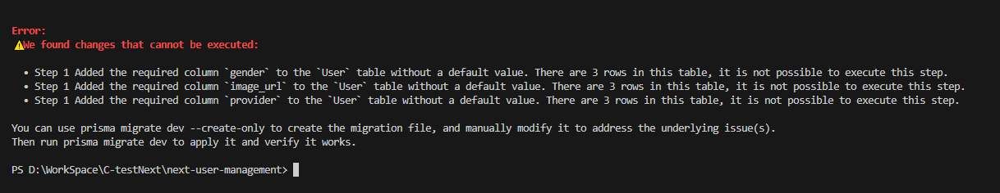

>작성일 : 2025.01.22

## 문제 상황



Prisma schema에 새로운 필수(required) 컬럼을 추가하고 마이그레이션을 실행할 때, 다음과 같은 에러가 발생할 수 있습니다:

```
Error: 
No found changes that cannot be executed:
• Step 1 Added the required column 'gender' to the 'User' table without a default value. There are 3 rows in this table, it is not possible to execute this step.
```

이 에러는 이미 데이터가 있는 테이블에 기본값이 없는 필수 컬럼을 추가하려고 할 때 발생합니다.

## 해결 방법

### 1. Schema 수정

먼저 schema.prisma 파일에서 새로운 컬럼들에 기본값을 추가합니다:

```prisma
model User {
  id          Int      @id @default(autoincrement())
  email       String   @unique
  password    String
  role        String   @default("R001")
  nickname    String?
  gender      String   @default("")    // 기본값 설정
  image_url   String   @default("")    // 기본값 설정
  provider    String   @default("local") // 기본값 설정
}
```

### 2. 마이그레이션 파일 생성

다음 명령어를 실행하여 마이그레이션 파일을 생성합니다:

```bash
npx prisma migrate dev --create-only
```

### 3. 마이그레이션 파일 수정

생성된 마이그레이션 파일에서 SQL 쿼리를 다음과 같이 수정합니다:

```sql
ALTER TABLE "User" ADD COLUMN "gender" TEXT NOT NULL DEFAULT '';
ALTER TABLE "User" ADD COLUMN "image_url" TEXT NOT NULL DEFAULT '';
ALTER TABLE "User" ADD COLUMN "provider" TEXT NOT NULL DEFAULT 'local';
```

### 4. 마이그레이션 실행

마지막으로 마이그레이션을 실행합니다:

```bash
npx prisma migrate dev
```

## 결론

이 방법을 통해 기존 데이터를 유지하면서 새로운 필수 컬럼을 안전하게 추가할 수 있습니다. 새로운 컬럼에 기본값을 설정함으로써 기존 레코드들도 자동으로 해당 기본값을 가지게 됩니다.

이는 데이터베이스 마이그레이션 시 자주 발생하는 문제이며, Prisma의 마이그레이션 기능을 활용하여 효과적으로 해결할 수 있습니다.