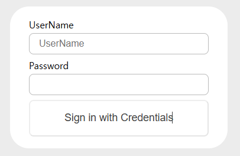
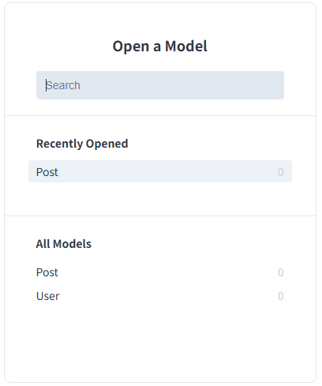
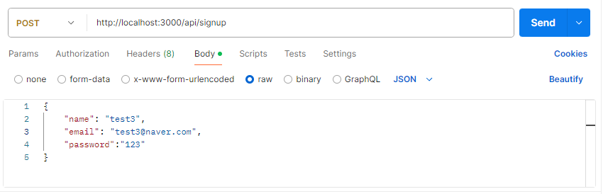
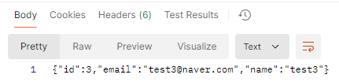
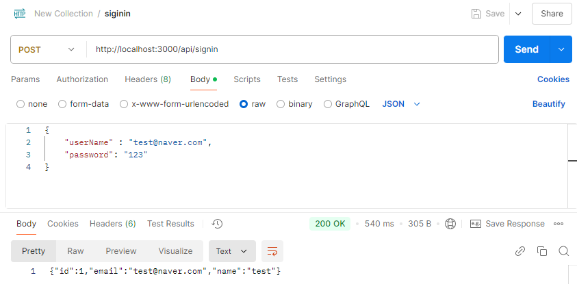
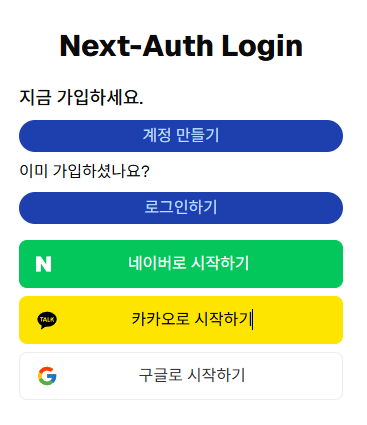
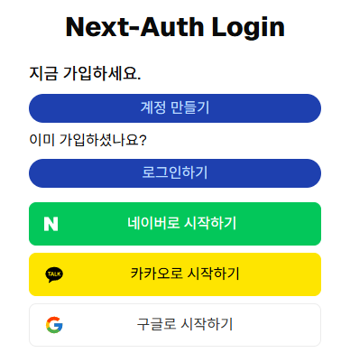
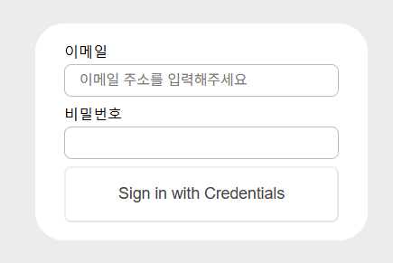
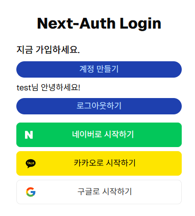

> 작성일 : 2024.12.24

## 1. Next.js 프로젝트 생성

npx create-next-app@latest next-auth-login

## 2. 프로젝트 디렉토리로 이동

cd my-nextjs-app

## 3. 추가 패키지 설치 (선택사항)
```bash
// shadcn 설치
npx --legacy-peer-deps shadcn@latest init
npx --legacy-peer-deps shadcn@latest add button, dialog, card
npm install react-icons

// next-auth 설치 (필수)
npm install next-auth
```
## 4. API 라우트 설정

반드시 /app/api/auth/[...nextauth]/route.ts 파일 생성 후 코드 입력

```ts
import NextAuth from "next-auth";
import CredentialsProvider from "next-auth/providers/credentials";

const handler = NextAuth({
  providers: [
    // ID, PW 로그인 방식
    CredentialsProvider({
      name: "Credentials",
      credentials: {
        userName: { label: "UserName", type: "text", placeholder: "UserName" },
        password: { label: "Password", type: "password" },
      },

      async authorize(credentials, req) {
        const user = { id: "1", name: "JK", email: "qkrwhd1122@gmail.com" };
        if (user) {
          return user;
        } else {
          return null;
        }
      },
    }),
  ],
});

export { handler as GET, handler as POST };
```

Next-auth에서 기본적인 로그인폼 지원
http://localhost:3000/api/auth/signin 에 이동 시 이런 화면이 나옴



이 화면에서 클릭 시 http://localhost:3000/ 으로 이동됨

### Prisma 설정

로그인할 때 `authorize()` 함수를 통해 사용자 유효성 검증하기 위해 Prisma를 통해 DB를 제어할 예정

### Prisma 설치

```typescript
//prisma 설치
$npm install prisma -D

//prisma 초기화(sqlite 사용)
$npx prisma init --datasource-provider sqlite
```

위의 두 명령어를 입력했다면 `prisma` 폴더가 생성되었을 것이다.

이 안에는 `schema.prisma` 파일이 들어있는데 `model` 이라고 부른다.  
( sqlite, postgreSql, MySql 등에서는 **테이블로 전환된다.**)

```typescript
// /prisma/schema.prisma

// This is your Prisma schema file,
// learn more about it in the docs: https://pris.ly/d/prisma-schema

generator client {
  provider = "prisma-client-js"
}

datasource db {
  provider = "sqlite"
  url      = env("DATABASE_URL")
}
```

`generator client`  - Prisma는 백앤드 영역이기 때문에 Client 쪽에서 DB에 접근하려면 prisma-client가 필요하다.

`datasource db` : -어떤 DB를 사용할지, 해당 파일의 url을 적어둔다. `.env` 파일을 보면  `DATABASE_URL="file:./dev.db"` 라고 추가되어 있는데 `dev.db` 파일로 `sqlite` 파일을 저장한다는 뜻이다.

[Prisma 공식 홈페이지](https://pris.ly/d/prisma-schema)
에 들어가면 기본적인 User 와 Post 모델 예제가 나와있다.
테이블은 `model` 로 정의하고 보통 대문자로 선언한다.

### Prisma Migrate

스키마 작성을 완료하면 sqlite 파일을 만들어 주어야 한다.

```typescrpit
$npx prisma migrate dev --name init
```


명령어를 실행하면 `dev.db` & `dev.db-joumal` 파일이 생성된다.


Prisma는 `Studio`라는 툴을 통해 웹상에서 테이블을 조작할 수 있다.

```typescript
npx prisma studio
Environment variables loaded from .env
Prisma schema loaded from prisma\schema.prisma
Prisma Studio is up on http://localhost:5555
```

명령어를 실행하면 테이블을 쉽게 조작할 수 있는 페이지가 나온다.



### Prisma Client 설치

Prisma 설치는 완료했지만 Next.js 에서 사용하려면 `Prisma Client`를 설치해 주어야한다.

```typescript
$npm install @prisma/client
```

설치가 완료되면 이를 사용하기 위한 모듈을 만들어준다.

```typescript
// /app/lib/prisma.ts

import { PrismaClient } from "@prisma/client";

const globalForPrisma = global as unknown as { prisma: PrismaClient };

export const prisma = globalForPrisma.prisma || new PrismaClient();

if (process.env.NODE_ENV !== "production") globalForPrisma.prisma = prisma;

export default prisma;
```

이로써 Prisma 세팅은 완료되었다.

## Next.js API 구현

Next.js 앱에서 내부 API를 사용하려면 `/app/api` 경로에 로직을 구현하면 된다.

13 버전부터는 API 파일은 `route.js` 로 명명해야 한다.

### 회원가입(SignUp) 구현

`app/api/signup/route.ts` 파일을 만들고  
`https://localhost:3000/api/signup` 를 호출해 사용할 수 있다.

```typescript
//app/api/signup/route.ts

import prisma from "@/lib/prisma";

interface RequestBody {
  name: string;
  email: string;
  password: string;
}

export async function POST(request: Request) {
  const body: RequestBody = await request.json();

  const user = await prisma.user.create({
    data: {
      name: body.name,
      email: body.email,
      password: body.password,
    },
  });

  // user 객체에서 password 값은 제외
  const { password, ...result } = user;
  return new Response(JSON.stringify(result));
}
```

POST methods 의 body를 `request.json()`을 통해 추출하고

`prisma.user.create` 명령어를 통해 User 테이블에 데이터를 넣는다.

데이터가 정상적으로 들어가면 해당 객체를 반환하게 되는데

여기서 비밀번호를 제외한 값을 최종 Response 로 리턴해준다.

**🚨 비밀번호를 평문으로 저장하는 방법은 보안적으로 문제가 있다.**

자바스크립트에서 많이 사용하는 `bcrypt`를 통해 비밀번호를 Hash로 암호화할것이다.

```typescript
$npm install bcrypt
$npm i --save-dev @types/bcrypt
```

```typescript
//app/api/signup/route.ts

import prisma from '@/lib/prisma'
import * as bcrypt from 'bcrypt'

~
export async function POST(request: Request) {
	~
  const user = await prisma.user.create({
    data: {
     ~
		password: await bcrypt.hash(body.password,  10) // 변경
    },
  })

~
}
```

### 회원가입 API 테스트

위에서 만든 api의 request url은 `https://localhost:3000/api/signup` 이다.



### 로그인(SignIn) 구현

회원가입과 마찬가지로 `/app/api/signin` 경로에 `route.ts` 파일을 만들어 준다.

```typescript
//app/api/signin/route.ts

import prisma from "@/lib/prisma";
import * as bcrypt from "bcrypt";

interface RequestBody {
  userName: string;
  password: string;
}

export async function POST(request: Request) {
  const body: RequestBody = await request.json();
  const user = await prisma.user.findFirst({
    where: {
      email: body.userName,
    },
  });

  if (user && (await bcrypt.compare(body.password, user.password))) {
    const { password, ...userWithoutPass } = user;
    return new Response(JSON.stringify(userWithoutPass));
  } else {
    return new Response(JSON.stringify(null));
  }
}
```

`findFirst` 를 통해 입력받은 `username` 과 `email` 컬럼 값이 동일한 유저를 먼저 찾은 후 `bcrypt.compare` 함수를 통해 비밀번호를 비교한다.

### 로그인 API 테스트

위에서 만든 api의 request url은 `https://localhost:3000/api/signin` 이다.


정보가 일치하면 해당 유저 정보를 return 해준다.

### 로그인 API, NextAuth에 적용하기

만든 API를 next-auth에 적용해야 한다.

```typescript
// app/api/auth/[...nextauth]/route.ts
import NextAuth from "next-auth";
import CredentialsProvider from "next-auth/providers/credentials";

const handler = NextAuth({
  providers: [
    // ID, PW 로그인 방식
    CredentialsProvider({
      name: "Credentials",
      credentials: {
        userName: {
          label: "이메일",
          type: "text",
          placeholder: "이메일 주소를 입력해주세요",
        },
        password: { label: "비밀번호", type: "password" },
      },

      async authorize(credentials, req) {
        const res = await fetch(`${process.env.NEXTAUTH_URL}/api/signin`, {
          method: "POST",
          headers: {
            "Content-Type": "application/json",
          },
          body: JSON.stringify({
            userName: credentials?.userName,
            password: credentials?.password,
          }),
        });

        const user = await res.json();
        console.log("$$$ user:", user);

        if (user) {
          return user;
        } else {
          return null;
        }
      },
    }),
  ],
});

export { handler as GET, handler as POST };
```

`authorize()` 함수를 통해 로그인을 제어한다.
위에서 만든 API를 fetch하고 받아온 사용자 정보를 `user`에 저장해 리턴한다.

✅ **Next-Auth 는 `null & false`를 리턴하지 않으면 로그인에 성공했다고 판단한다.** ✅



```tsx
"use client";

import { signIn } from "next-auth/react";
import Socials from "./Socials";
import Link from "next/link";

export default function Form() {
  return (
    <div className="space-y-4">
      <h2 className="mb-5 text-3xl font-extrabold text-center">
        Next-Auth Login
      </h2>
      <div className="space-y-2">
        <h1 className="text-lg font-medium">지금 가입하세요.</h1>
        <Link
          href="/signup"
          className="block bg-blue-800 text-blue-200 text-center py-1 rounded-2xl hover:bg-blue-700"
        >
          계정 만들기
        </Link>

        <h3 className="text-base mt-4">이미 가입하셨나요?</h3>
        <button
          className="w-full bg-blue-800 text-blue-200 py-1 rounded-2xl hover:bg-blue-700"
          onClick={() => signIn()}
        >
          로그인하기
        </button>
      </div>
      <Socials />
    </div>
  );
}
```

`signIn()` 함수는 next-auth 에서 제공하는 함수이고, 클릭 시 이전에 봤던 Login Form 화면으로 이동시켜준다.

로그인에 성공할 경우 next-auth 는 **💡브라우저 쿠키에 Session 을 저장**한다.
**☝🏻 Next Auth 자체를 클라이언트 사이드 세션으로도 볼 수 있다.**

### 앱에 Session 적용하기

`SesseionProvider` 로 컴포넌트를 감싸 하위 컴포넌트들에게 `Session` 을 공유할 수 있다.

```typescript
// components/provider/Providers.tsx

"use client";

import { SessionProvider } from "next-auth/react";
import React, { ReactNode } from "react";

interface Props {
  children: ReactNode;
}
function Providers({ children }: Props) {
  return <SessionProvider>{children}</SessionProvider>;
}

export default Providers;
```

`Providers.tsx` 컴포넌트를 만들고 `/app/layout.tsx`에 적용한다.

```typescript
// app/layout.tsx

export default function RootLayout({
  children,
}: Readonly<{
  children: React.ReactNode;
}>) {
  return (
    <html lang="en">
      <body
        className={`${geistSans.variable} ${geistMono.variable} antialiased`}
      >
        <Providers>{children}</Providers>
      </body>
    </html>
  );
}
```

### 로그인 화면 수정

```tsx
"use client";

import { signIn, signOut, useSession } from "next-auth/react";
import Socials from "./Socials";
import Link from "next/link";

export default function Form() {
  const { data: session } = useSession();
  return (
    <div className="space-y-4">
      <h2 className="mb-5 text-3xl font-extrabold text-center">
        Next-Auth Login
      </h2>
      <div className="space-y-2">
        <h1 className="text-lg font-medium">지금 가입하세요.</h1>
        <Link
          href="/signup"
          className="block bg-blue-800 text-blue-200 text-center py-1 rounded-2xl hover:bg-blue-700"
        >
          계정 만들기
        </Link>
        {session && session.user ? (
          <>
            <h3>{session.user.name}님 안녕하세요!</h3>
            <button
              className="w-full bg-blue-800 text-blue-200 py-1 rounded-2xl hover:bg-blue-700"
              onClick={() => signOut()}
            >
              로그아웃하기
            </button>
          </>
        ) : (
          <>
            <h3 className="text-base mt-4">이미 가입하셨나요?</h3>
            <button
              className="w-full bg-blue-800 text-blue-200 py-1 rounded-2xl hover:bg-blue-700"
              onClick={() => signIn()}
            >
              로그인하기
            </button>
          </>
        )}
      </div>
      <Socials />
    </div>
  );
}
```

#### 로그인 전


#### 로그인 버튼 클릭 시


#### 로그인 후

