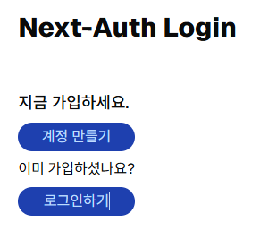
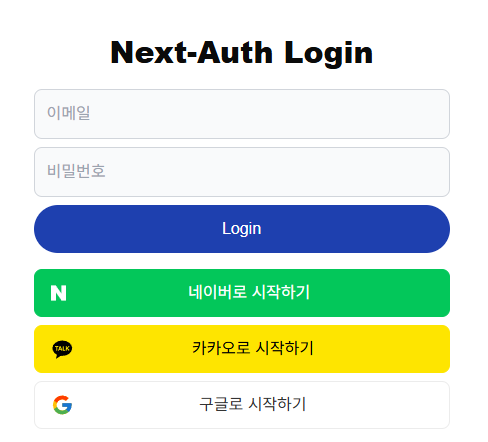

> 작성일 : 2024.12.25

## 커스텀 로그인 페이지 만들기

`NextAuth`는 로그인, 로그아웃, 에러 등 간단한 인증 페이지를 제공해 준다.

기본으로 제공하는 화면들을 커스텀 페이지로 대체할 수 있는데, `pages:{}` 를 사용하면 된다.

> #### 💡 pages 구성 목록

```tsx
 import NextAuth from 'next-auth/next'
 const handler = NextAuth({
 providers: [
  ...
  ],
 callbacks:{
 ...
 },
 pages:{
 signIn: '/auth/signin',
 signOut: '/auth/signout',
 error: '/auth/error', // Error code passed in query string as ?error=
 verifyRequest: '/auth/verify-request', // (used for check email message)
 newUser: '/auth/new-user' // New users will be directed here on first sign in (leave the property out if not of interest)
 }
 })
 export { handler as GET, handler as POST }
```

> #### ☝🏻 페이지가 실제로 존재하는 경로를 입력해주어야 한다.

`/app/(auth)/signin/page.tsx` 경로에 파일을 만들고, `LoginForm` 컴포넌트를 사용한다.

```tsx
import LoginForm from "@/components/form/LoginForm";

export default function LoginModal() {
  return <LoginForm />;
}
```

```tsx
"use client";

import { ChangeEventHandler, FormEventHandler, useState } from "react";
import Socials from "./Socials";
import { signIn } from "next-auth/react";

export default function LoginForm() {
  const [email, setEmail] = useState("");
  const [password, setPassword] = useState("");

  const handleSubmit: FormEventHandler<HTMLFormElement> = async (event) => {
    event.preventDefault();
    const result = await signIn("credentials", {
      username: email,
      password: password,
      redirect: true,
      callbackUrl: "/",
    });
    console.log(result);
  };

  const onChangeEmail: ChangeEventHandler<HTMLInputElement> = (e) => {
    setEmail(e.target.value);
  };

  

  const onChangePassword: ChangeEventHandler<HTMLInputElement> = (e) => {
    setPassword(e.target.value);
  };

  

  return (
    <div className="min-h-screen flex items-center justify-center">
      <div className="space-y-4 w-full max-w-md px-4">
        <h2 className="mb-5 text-3xl font-extrabold text-center">
          Next-Auth Login
        </h2>
        <form onSubmit={(e) => handleSubmit(e)} className="space-y-2">
          <input
            name="email"
            placeholder="이메일"
            onChange={onChangeEmail}
            className="w-full p-3 border border-gray-300 rounded-lg bg-gray-50"
          />

          <input
            type="password"
            name="password"
            placeholder="비밀번호"
            onChange={onChangePassword}
            className="w-full p-3 border border-gray-300 rounded-lg bg-gray-50"
          />

          <button className="w-full py-3 bg-blue-800 text-blue-200rounded-2xl hover:bg-blue-700 text-white rounded-3xl">
            Login
          </button>
        </form>
        <Socials />
      </div>
    </div>
  );
}
```

#### 로그인 전



#### 로그인 화면



#### 로그인 후

메인 화면으로 이동


