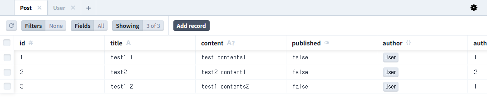
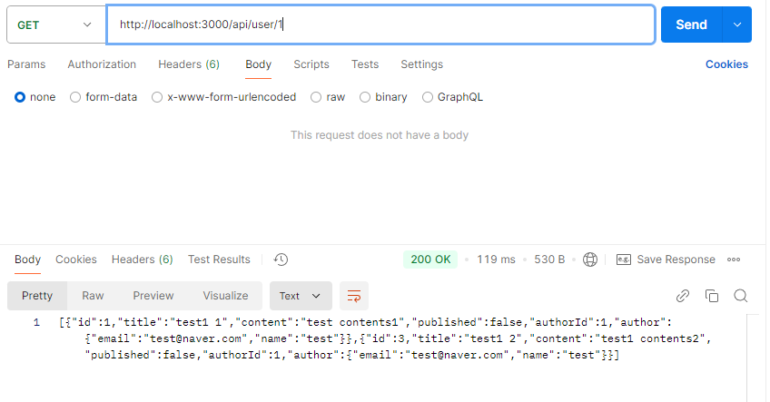
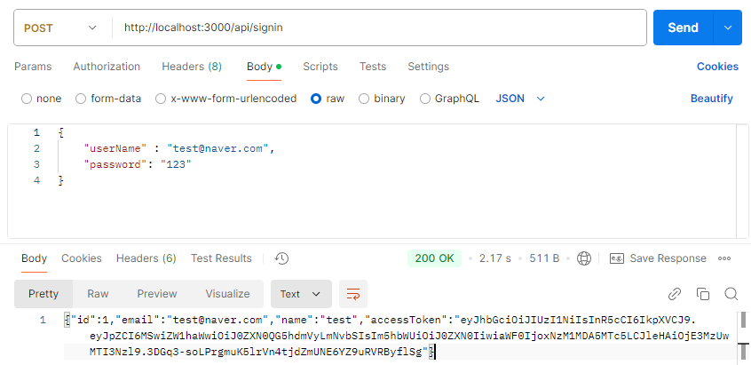
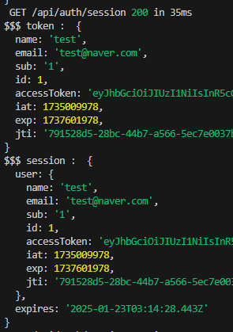
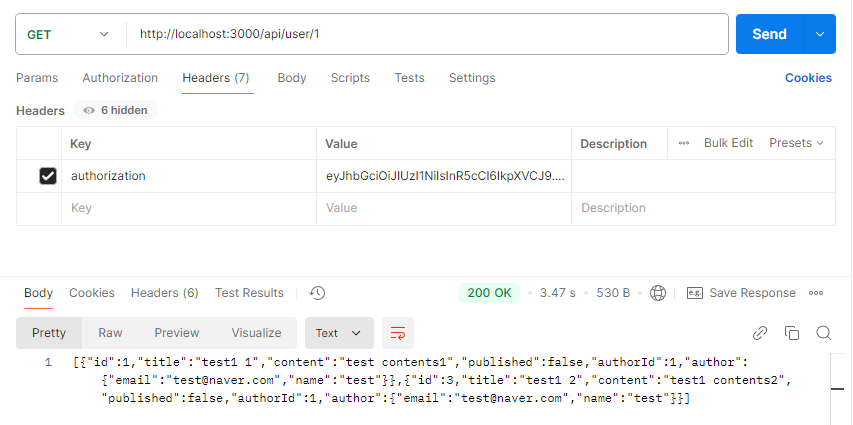
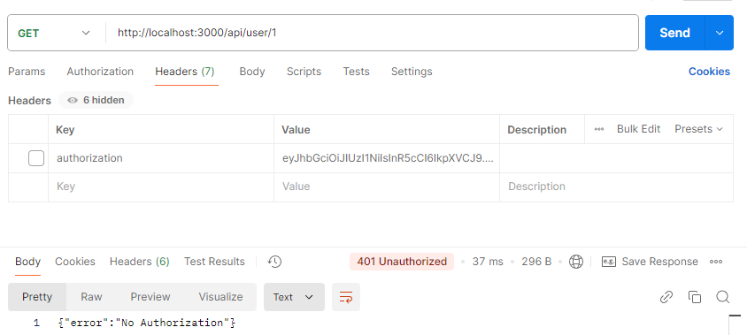

> 작성일 : 2024.12.25

## 유효성 검사 With JWT Token

`/app/api/user/[id]` 경로에 `route.ts` 파일을 만들어 준다.
API 에서도 페이지와 같이 `Dynamic Route` 를 사용할 수 있다.
여기서는 `[id]` 값을 slug로 사용한다.

```typescript
//app/api/user/[id]/route.ts

import prisma from "@/lib/prisma";

export async function GET(
  request: Request,
  { params }: { params: { id: string } }
) {
  const id = Number(params.id);
  const userPosts = await prisma.post.findMany({
    where: {
      authorId: id,
    },
    include: {
      author: {
        select: {
          email: true,
          name: true,
        },
      },
    },
  });
  return new Response(JSON.stringify(userPosts));
}
```



> slug = 동적 라우팅(Dynamic Routing)을 위해 사용되는 URL의 변수 부분



## Token 을 사용해 Session 보호

현재는 Request url 만 알고 있으면 로그인을 하지 않아도 해당 데이터를 조회해 볼 수 있다.
Next-Auth에서는 인가되지 않은 사용자의 접근을 막기 위해 `JWT Token` 을 다루는 기능들을 제공한다.
☝🏻 먼저, 로그인 시 리턴되는 `User` 객체에 `JWT Token` 을 추가할 것이고
✌🏻 이 토큰을 NextAuth의 Session에 저장해 로그인 된 상태에서 사용 가능하도록 할 것이다.
💡 토큰을 세션에 저장하면 외부에 노출하지 않고 안전하게 사용할 수 있다.
🤟🏻 마지막으로 게시물 조회 API에서도 이 `accessToken` 이 있어야 호출될 수 있도록 변경할 것이다.

### JWT 패키지 설치 및 토큰 생성🧑🏻‍⚕️

```typescript
$ npm install jsonwebtoken

// type도 설치해준다.
$ npm install -D @types/jsonwebtoken
```

설치가 완료되었으면 `.env` 파일에 `SECRET_KEY` 환경변수를 만들어 준다.

```typescript
NEXTAUTH_URL=http://localhost:3000
NEXTAUTH_SECRET=topsecret
SECRET_KEY=nextauthsecretkey // << 추가

DATABASE_URL="file:./dev.db"
```

그 다음 `app/lib` 경로에 토큰을 생성하는 `jwt.ts` 를 만들어준다.

```typescript
// app/lib/jwt.ts
import jwt, { JwtPayload } from "jsonwebtoken";

interface SignOption {
  expiresIn?: string | number;
}

const DEFAULT_SIGN_OPTION: SignOption = {
  expiresIn: "1h",
};

export function signJwtAccessToken(
  payload: JwtPayload,
  options: SignOption = DEFAULT_SIGN_OPTION
) {
  const secret_key = process.env.SECRET_KEY;
  const token = jwt.sign(payload, secret_key, options);
  return token;
}
```

`signJwtAccessToken()` 함수는 `jwt.sign()`를 통해 토큰을 리턴해준다.

토큰을 만들었으니 API 콜이 왔을 때 토큰의 유효성 체크를 해주는 `verifyJwt()` 함수도 만들어 준다.

```typescript
// app/lib/jwt.ts
~~
export function verifyJwt(token: string) {
  try {
    const secret_key = process.env.SECRET_KEY;
    const decoded = jwt.verify(token, secret_key!);
    return decoded as JwtPayload;
  } catch (error) {
    console.log("error occured : ", error);
    return null;
  }
}
```

### 로그인 시 accessToken 전달

기존 `api/signin/route.ts` 의 로직을 일부 변경해야한다.

```typescript
// api/signin/route.ts

import { signJwtAccessToken } from "@/lib/jwt";
import prisma from "@/lib/prisma";
import * as bcrypt from "bcrypt";

interface RequestBody {
  userName: string;
  password: string;
}

export async function POST(request: Request) {
  const body: RequestBody = await request.json();
  const user = await prisma.user.findFirst({
    where: {
      email: body.userName,
    },
  });

  if (user && (await bcrypt.compare(body.password, user.password))) {
    const { password, ...userWithoutPass } = user;
    const accessToken = signJwtAccessToken(userWithoutPass);
    const result = {
      ...userWithoutPass,
      accessToken,
    };
    return new Response(JSON.stringify(result));
  } else {
    return new Response(JSON.stringify(null));
  }
}
```

Postman을 통해 로그인 api 를 호출하면 `accessToken` 이 추가된걸 볼 수 있다.


**✅ `authorize()` 를 수정해 토큰을 `Session` 에 저장해보자!**

```typescript
// /app/api/auth/[...nextahtu]/route.ts
~
const handler = NextAuth({
  ~
  callbacks: {
    async jwt({ token, user }) {
      return { ...token, ...user };
    },
    async session({ session, token }) {
      console.log("$$$ token : ", token);
      session.user = token as never;
      console.log("$$$ session : ", session);
      return session;
    },
  },
});
~
```

`callbacks` 옵션은 로그인 로직( `authorize()`)을 수행한 이후 실행되는 부분이다.


`jwt()` 콜백 함수에서 `token` 과 `user` 정보를 `object` 로 만들어 리턴하면 `session()` 콜백 함수에 `token` 으로 전달된다.

`session()` 콜백에서는 전달받은 값을 `session.user` 에 넣어 리턴해주어야 `Client` 에서 사용이 가능하다.

클라이언트에서는 `const {data: session} = useSession()` 를 호출해 사용할 수 있다.

### Session.user의 type 커터마이징 하기

Next-Auth 의 type을 보면 `accessToken` 이 정의되어있지 않다.

그렇기 때문에 type 커스터마이징이 필요하며, `/app/type` 경로에 `next-auth.d.ts` 파일을 만들어 구현한다.

```typescript
// app/types/next-auth.d.ts

import NextAuth from "next-auth";
declare module "next-auth" {
  interface Session {
    user: {
      id: number;
      name: string;
      email: string;
      accessToken: string;
    };
  }
}
```

### API 호출 시 accessToken 유효성 검사

게시물 조회 api인 `/api/user/[id]/route.ts` 를 호출 할 때 토큰을 검사하는 로직을 추가해 볼 것이다.

```typescript
// /api/user/[id]/route.ts

import prisma from "@/app/lib/prisma";
import { verifyJwt } from "@/app/lib/jwt";
export async function GET(
  request: Request,
  { params }: { params: { id: string } }
) {
  // accessToken 유효성 검사
  const accessToken = request.headers.get("authorization");

  if (!accessToken || !verifyJwt(accessToken)) {
    return new Response(JSON.stringify({ error: "No Authorization" }), {
      status: 401,
    });
  }
  console.log(params);
  const id = Number(params.id);
  const userPosts = await prisma.post.findMany({
    where: {
      authorId: id,
    },
    include: {
      author: {
        select: {
          email: true,
          name: true,
        },
      },
    },
  });
  return new Response(JSON.stringify(userPosts));
}
```

`request.headers` 의 `authorization` 에 `accessToken` 이 없거나

`verifyJwt()` 유효성 검사를 통과하지 못하면 `401(Unauthorized)` 에러를 리턴한다.

**⭕️ 통과**



**❌ 차단**



### Middleware를 이용한 유효성 검사

App Router 에서는 `Middleware` 기능을 제공한다.
`Middleware`는 페이지가 렌더링 되기 전에 `로그인 여부`, `권한 체크` 등의 작업을 수행할 수 있다.
활용 방법은 무궁무진하지만 이번에는 페이지 진입 전, 로그인 여부를 판단해 접근을 차단하는 작업만 하겠다.
`/app` 과 동일한 레벨에 `middleware.ts` 파일을 만들어 설정한다.

```typescript
export { default } from "next-auth/middleware";

export const config = {
  matcher: ["/userposts/:path*"],
};
```

`config` 안에 있는 matcher에 페이지 경로를 등록하면 해당 페이지는 로그인한 사용자만 접근할 수 있다.


**✅ 로그인 하지않은 사용자가 접근하게되면 로그인 화면으로 리다이렉트 시킨다.**
