> 작성일 : 2024.12.26

### KAKAO Developer 앱 등록하기

카카오 서비스를 이용하기 위해서는 [카카오 개발자 사이트](https://developers.kakao.com/) 에 앱을 등록해야 한다.

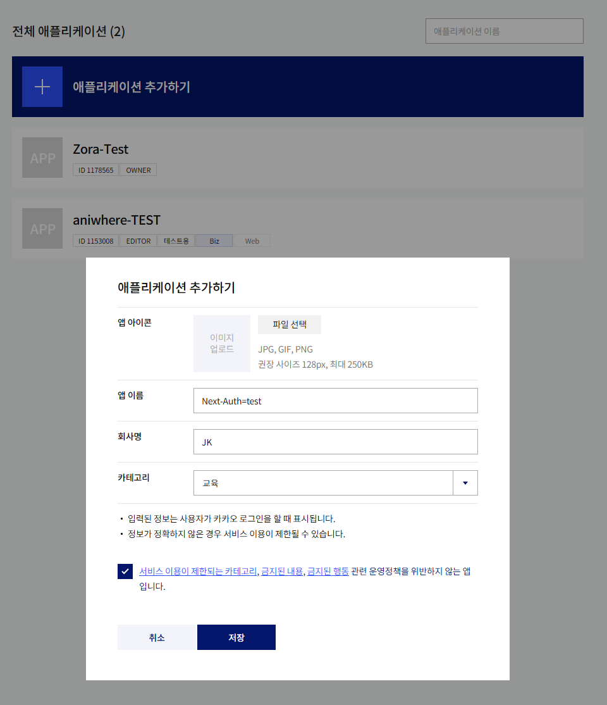

앱설정 > 앱키에서 필요한 앱키를 가져온다
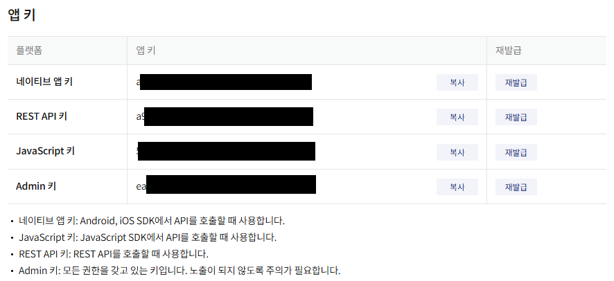

위 키를 `.env`파일에 넣는다
`KAKAO_CLIENT_ID`: `Javascript 키`  
`KAKAO_CLIENT_SECRET`: `임의의 문자열`

```typescript
KAKAO_CLIENT_ID = asdfasdfasdfasdf;
KAKAO_CLIENT_SECRET = kakaosecretKeyjkpark;
```

### 앱 설정하기

카카오 개발자 사이트에 앱을 등록했다면 `Redirect URI`, `도메인` 등을 설정해주어야 한다.

#### Redirect URI

Redirect URI: `http://localhost:3000/api/auth/callback/kakao`
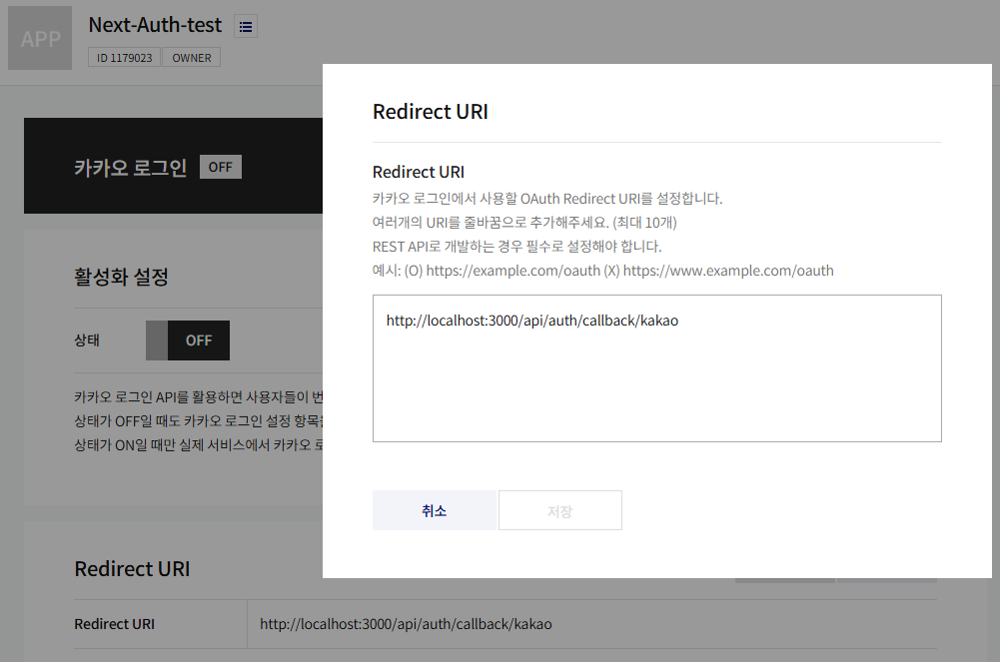

#### 도메인

사이트 도메인: `http://localhost:3000`
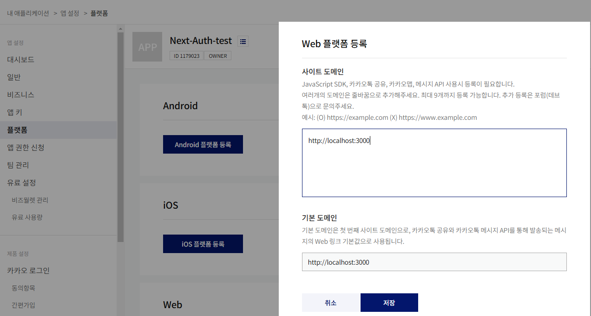

#### 카카오 로그인 활성화

`제품 설정 > 카카오 로그인` 탭
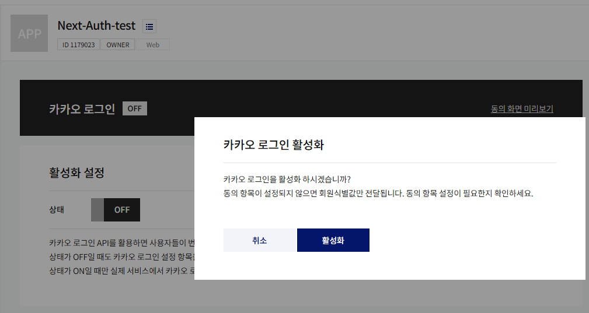

#### ### NextAuth 설정

코드로 돌아와서, `KakaoProvider` 를 추가해 줄 차례이다.

```typescript
// /api/auth/[...nextauth]/route.ts

import KakaoProvider from "next-auth/providers/kakao";

~
providers: [
  // 카카오 프로바이더
  KakaoProvider({
    clientId: process.env.KAKAO_CLIENT_ID!,
    clientSecret: process.env.KAKAO_CLIENT_SECRET!
  })
]
~
```

##### kakao Signin 기능 추가

/src/components/form/Social.tsx

```tsx
export default function Socials() {
  return (
    <div className={styles.container}>
      <div className={styles.naver}>
        <button className={styles.button}>
          <SiNaver size={16} color="#fff" />
          <span>네이버로 시작하기</span>
        </button>
      </div>
      <div className={styles.kakao}>
        <button
          className={styles.button}
          // 여기에 추가
          onClick={() => signIn("kakao", { redirect: true, callbackUrl: "/" })}
        >
          <RiKakaoTalkFill size={24} />
          <span>카카오로 시작하기</span>
        </button>
      </div>
      <div className={styles.google}>
        <button className={styles.button}>
          <FcGoogle size={24} color="#fff" />
          <span>구글로 시작하기</span>
        </button>
      </div>
    </div>
  );
}
```

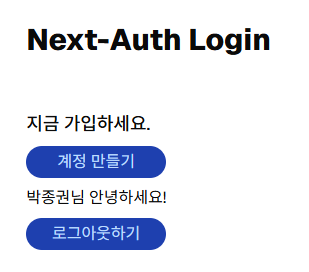

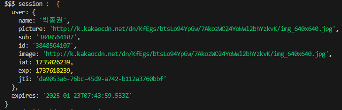
로그인 되는 거 성공

## 네이버(Naver) 로그인

이전 카카오 로그인 포스팅과 같이 네이버 로그인도 어렵지 않게 구현할 수 있다.

네이버 개발자 센터에서 앱 등록부터 시작해보자!

### Naver Developers 앱 등록

먼저, [네이버 개발자 센터](https://developers.naver.com/main/)에 들어가 앱 등록을 해야한다.

`홈 페이지` > `네이버 로그인` > `오픈 API 이용 신청` > `약관동의` > `본인인증` 까지 완료한다.  


본인 인증까지 완료하면 `애플리케이션 등록` 화면이 나온다.  
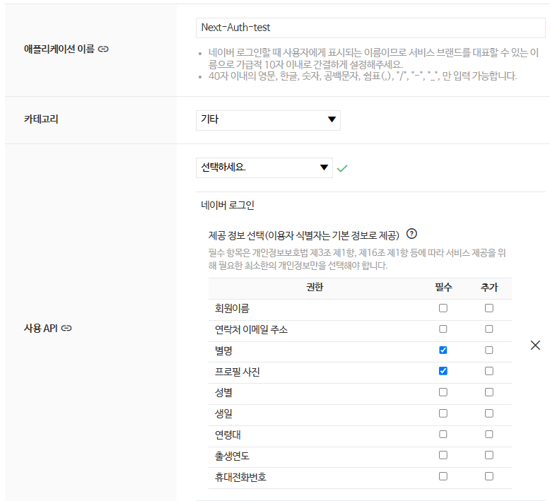

애플리케이션 이름은 `nextauth-social` 로 설정했으며, 사용 API는 `네이버 로그인` 으로 선택한다.

그러면 아래와 같이 `제공 정보 선택`을 해야하는데, 간단하게 `이름` 과 `프로필사진` 정도만 가져 와보겠다.

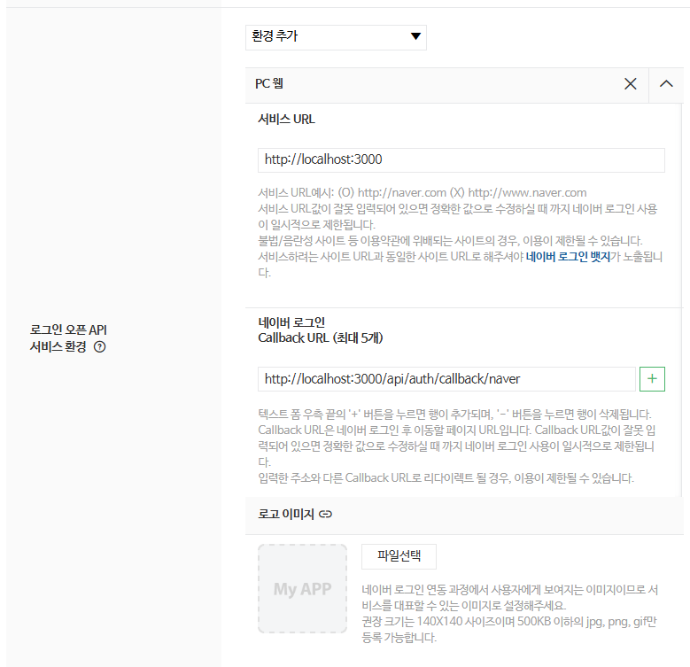

`환경 추가` 에서 `PC 웹` 을 선택하고 서비스 `URL` 을 등록해준다.

서비스 URL: `http://localhost:3000`  
Callback URL: `http://localhost:3000/api/auth/callback/naver`

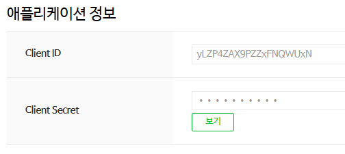

앱을 등록하고 나면 `Client ID` & `Client Secret` 등 애플리케이션 정보를 확인할 수 있다.

### NextAuth 설정

코드로 돌아와서, `NaverProvider` 를 추가해 줄 차례이다.

```typescript
import NaverProvider from "next-auth/providers/naver";

...
// /api/auth/[...nextauth]/route.ts
providers: [
  // 네이버 프로바이더
  NaverProvider({
    clientId: process.env.NAVER_CLIENT_ID!,
    clientSecret: process.env.NAVER_SECRET!
  })
]
...
```

그 다음 `NAVER_CLIENT_ID` 와 `NAVER_CLIENT_SECRET` 를 환경변수로 설정해준다.

```typescript
// .env
NAVER_CLIENT_ID = xxxxxxxxxxxxxxxxx;
NAVER_SECRET = xxxxxxxxxxxxxxxxxxx;
```

> 🚨 환경변수를 변경했을 때에는 `npm run dev` 로 재실행 시켜주어야 한다.

`signIn("naver", { redirect: true, callbackUrl: "/" })` 를 액션에 추가해 소셜로그인 가능

```tsx
<button
  className={styles.button}
  onClick={() => signIn("naver", { redirect: true, callbackUrl: "/" })}
>
  <SiNaver size={16} color="#fff" />
  <span>네이버로 시작하기</span>
</button>
```

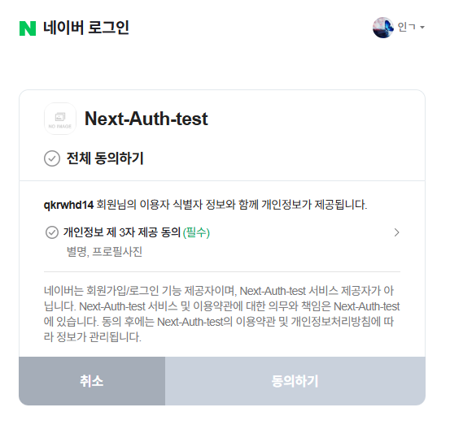
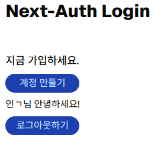

네이버 로그인 성공

## 구글(Google) 로그인

google cloud에 방문하여 애플리케이션 등록, key를 발급 받는다.
[구글 클라우드 링크](https://cloud.google.com/?hl=ko)

새 프로젝트 시작
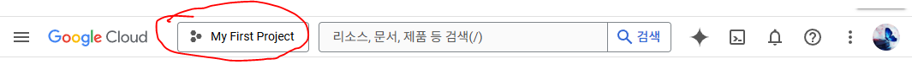
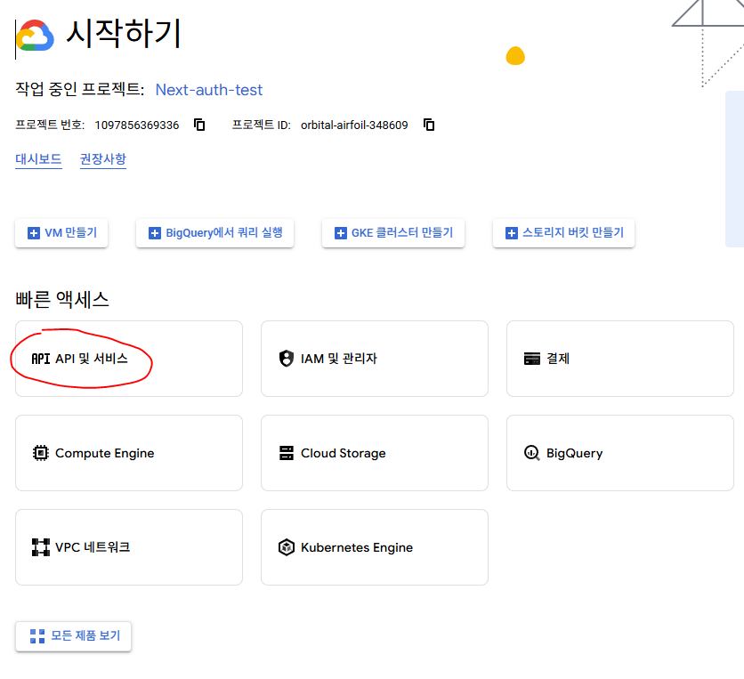
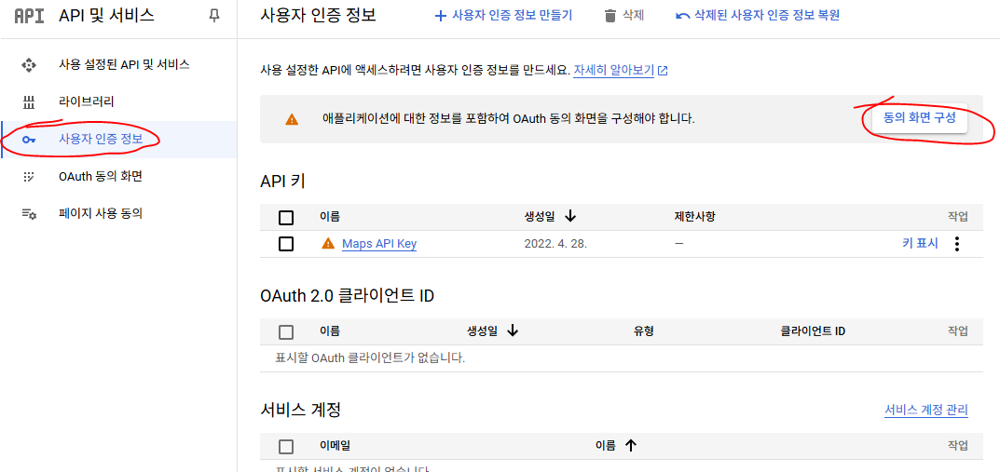
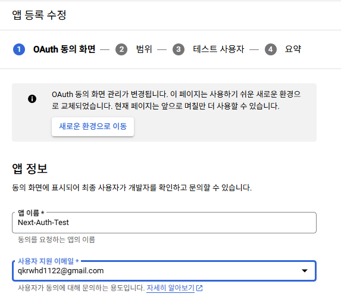
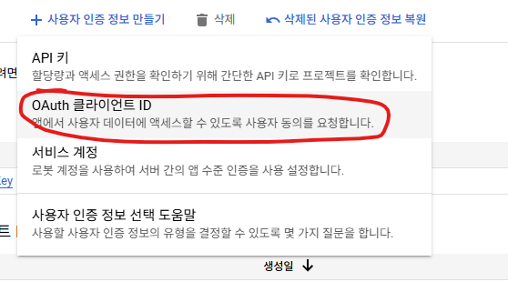
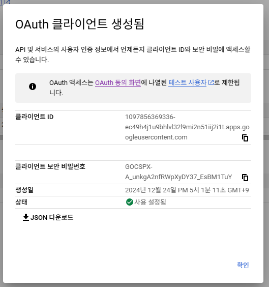

NextAuth 설정

코드로 돌아와서, `GoogleProvider` 를 추가해 줄 차례이다.

```typescript
import GoogleProvider from "next-auth/providers/naver";

...
// /api/auth/[...nextauth]/route.ts
providers: [
  // 네이버 프로바이더
  GoogleProvider({
    clientId: process.env.GOOGLE_CLIENT_ID!,
    clientSecret: process.env.GOOGLE_SECRET!
  })
]
...
```

그 다음 `GOOGLE_CLIENT_ID` 와 `GOOGLE_SECRET` 를 환경변수로 설정해준다.

```typescript
// .env
GOOGLE_CLIENT_ID = xxxxxxxxxxxxxxxxx;
GOOGLE_SECRET = xxxxxxxxxxxxxxxxxxx;
```

> 🚨 환경변수를 변경했을 때에는 `npm run dev` 로 재실행 시켜주어야 한다.

`signIn("google", { redirect: true, callbackUrl: "/" })` 를 액션에 추가해 소셜로그인 가능

```tsx
<button
  className={styles.button}
  onClick={() => signIn("google", { redirect: true, callbackUrl: "/" })}
>
  <FcGoogle size={16} color="#fff" />
  <span>구글로 시작하기</span>
</button>
```
