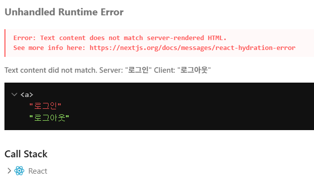

## 목차

1. [Hydration 에러란?](#hydration-에러란)
2. [일반적인 발생 원인](#일반적인-발생-원인)
3. [해결 방법](#해결-방법)
4. [모범 사례](#모범-사례)
5. [주의사항](#주의사항)

## Hydration 에러란?

Hydration 에러는 서버 사이드 렌더링(SSR)과 클라이언트 사이드 렌더링(CSR)의 결과가 일치하지 않을 때 발생하는 React의 오류입니다. 이는 주로 다음과 같은 경우에 발생합니다:

```plaintext
서버 렌더링: <div>로그인</div>
클라이언트 렌더링: <div>로그아웃</div>
```



## 일반적인 발생 원인

1. **localStorage/sessionStorage 사용**

   - 서버에서는 접근 불가
   - 클라이언트에서만 사용 가능

2. **window 객체 참조**

   - 서버에서는 window 객체 부재
   - 브라우저 특정 API 사용 시 발생

3. **동적 콘텐츠**
   - 시간에 따른 변화
   - 사용자 상태에 따른 변화

## 해결 방법

### 1. useEffect와 상태 관리

클라이언트 사이드에서만 상태를 변경하는 방법:

```typescript
import { useState, useEffect } from "react";

function LoginStatus() {
  const [mounted, setMounted] = useState(false);
  const [isLoggedIn, setIsLoggedIn] = useState(false);

  useEffect(() => {
    setMounted(true);
    const loginStatus = localStorage.getItem("isLoggedIn");
    setIsLoggedIn(!!loginStatus);
  }, []);

  if (!mounted) {
    return null; // 또는 로딩 상태
  }

  return <div>{isLoggedIn ? "로그아웃" : "로그인"}</div>;
}
```

### 2. Dynamic Import 사용

SSR을 비활성화하여 클라이언트에서만 렌더링:

```typescript
import dynamic from "next/dynamic";

const LoginComponent = dynamic(() => import("./LoginComponent"), {
  ssr: false,
});

function Page() {
  return (
    <div>
      <h1>내 페이지</h1>
      <LoginComponent />
    </div>
  );
}
```

### 3. 초기 상태 일치시키기

서버와 클라이언트의 초기 상태를 동일하게 설정:

```typescript
function AuthButton() {
  // 항상 false로 시작
  const [isLoggedIn, setIsLoggedIn] = useState(false);

  useEffect(() => {
    // 클라이언트에서만 실행
    const checkLoginStatus = () => {
      const stored = localStorage.getItem("isLoggedIn");
      if (stored) {
        setIsLoggedIn(JSON.parse(stored));
      }
    };

    checkLoginStatus();
  }, []);

  return <button>{isLoggedIn ? "로그아웃" : "로그인"}</button>;
}
```

## 모범 사례

### 1. 조건부 렌더링 최적화

```typescript
function MyComponent() {
  const [isClient, setIsClient] = useState(false);

  useEffect(() => {
    setIsClient(true);
  }, []);

  return <div>{isClient ? <ClientOnlyContent /> : <FallbackContent />}</div>;
}
```

### 2. 브라우저 API 사용

```typescript
function BrowserFeature() {
  const [windowWidth, setWindowWidth] = useState(0);

  useEffect(() => {
    function handleResize() {
      setWindowWidth(window.innerWidth);
    }

    // 클라이언트에서만 이벤트 리스너 추가
    window.addEventListener("resize", handleResize);
    handleResize();

    return () => window.removeEventListener("resize", handleResize);
  }, []);

  return <div>Window width: {windowWidth}px</div>;
}
```

## 주의사항

1. **성능 고려**

   - `useEffect` 사용 시 화면 깜박임 가능성
   - Dynamic Import는 초기 로딩 시간 증가

2. **SEO 영향**

   - SSR 비활성화는 SEO에 부정적 영향
   - 중요 컨텐츠는 SSR 유지 권장

3. **사용자 경험**
   - 초기 로딩 상태 처리 필요
   - 깜박임 최소화 전략 수립

## 마무리

Hydration 에러는 Next.js 애플리케이션에서 흔히 발생하는 문제지만, 적절한 전략을 선택하여 해결할 수 있습니다. 각 해결 방법은 장단점이 있으므로, 프로젝트의 요구사항에 맞는 최적의 방법을 선택하는 것이 중요합니다.

### 체크리스트

1. 서버와 클라이언트 코드 분리 확인
2. 브라우저 API 사용 시점 검토
3. 초기 상태 일관성 유지
4. SEO 요구사항 고려
5. 사용자 경험 최적화

이러한 가이드라인을 따르면 대부분의 Hydration 관련 문제를 효과적으로 해결할 수 있습니다.
